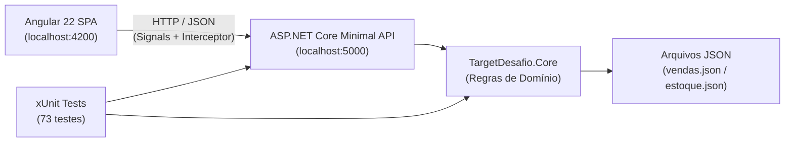

# Target Sistemas – Solução Full Stack do Desafio Técnico

[](https://dotnet.microsoft.com/)
[](https://angular.dev/)
[](https://xunit.net/)
[](https://developer.mozilla.org/pt-BR/docs/Web/CSS)

Aplicação **Full Stack** profissional desenvolvida para solucionar integralmente os três desafios propostos em [desafio_dev.md](desafio_dev.md):

1. **Cálculo de Comissões Comerciais** por faixas progressivas a partir de registros de vendas.
2. **Controle de Depósito e Movimentação de Estoque** (Entrada/Saída) com identificador único sequencial, histórico auditável e retorno em tempo real do estoque final.
3. **Cálculo Financeiro de Juros de Mora** (2,5% ao dia corrido de atraso) a partir do valor principal e da data de vencimento.

---

> [!NOTE]
> ### 🤖 Transparência: Desenvolvimento com Auxílio de Inteligência Artificial
> Este projeto foi concebido e desenvolvido em regime de **pair programming com auxílio de Inteligência Artificial (Google Antigravity)**. A IA foi utilizada para apoiar na concepção da arquitetura desacoplada, aceleração do scaffolding, escrita de testes de integração, refinamento do design system em CSS nativo e elaboração de documentação técnica, com revisão humana contínua para assegurar aderência estrita aos requisitos e aos padrões de excelência em engenharia de software (.NET e Angular).

---

## 🏛️ Arquitetura da Solução

A arquitetura adota separação de responsabilidades em camadas desacopladas. O domínio de negócio (`TargetDesafio.Core`) é completamente agnóstico de frameworks web e HTTP, permitindo testabilidade isolada e determinística.



### Estrutura de Diretórios

```
plantao/
├── backend/
│   ├── TargetDesafio.sln
│   ├── data/                                 # Dados originais do desafio
│   │   ├── vendas.json                       # Registros da equipe comercial
│   │   └── estoque.json                      # Catálogo inicial de produtos
│   ├── src/
│   │   ├── TargetDesafio.Core/               # Domínio e regras de negócio puras
│   │   │   ├── Comissao/                     # CalculadoraComissao, RegraComissao, Venda
│   │   │   ├── Estoque/                      # ServicoEstoque, RepositorioEstoque, Modelos, Exceções
│   │   │   └── Juros/                        # CalculadoraJuros, ResultadoJuros
│   │   └── TargetDesafio.Api/                # Minimal APIs, Swagger, CORS, ProblemDetails
│   │       ├── Endpoints/                    # ComissoesEndpoints, EstoqueEndpoints, JurosEndpoints
│   │       └── Configuracao/                 # ConfiguracaoDados e injeção de dependências
│   └── tests/
│       └── TargetDesafio.Tests/              # 73 testes unitários e de integração
│           ├── Comissao/                     # Testes de faixas e LINQ
│           ├── Estoque/                      # Testes de concorrência, saldo e repositório
│           ├── Juros/                        # Testes com TimeProvider e datas
│           └── Api/                          # Testes HTTP E2E via WebApplicationFactory
├── frontend/                                 # SPA Angular 22 (Standalone + Signals)
│   ├── src/
│   │   ├── app/
│   │   │   ├── core/                         # Services HTTP tipados, models e interceptor de erro
│   │   │   ├── shared/                       # Toasts flutuantes e loaders modernos
│   │   │   ├── layout/                       # Sidebar com status da API em tempo real e header
│   │   │   └── pages/                        # Dashboard, Comissões, Estoque e Juros
│   │   ├── environments/                     # URL base da API (localhost:5000/api)
│   │   ├── index.html                        # Google Fonts (Inter & Outfit) e SEO tags
│   │   └── styles.css                        # Design System completo em CSS nativo Glassmorphism
└── README.md
```

---

## 💼 Regras de Negócio Implementadas

### 1. Cálculo de Comissões (Exercício 1)
- **Regra de Faixas:**
  - Vendas $< \text{R\$} 100{,}00$: **0%** de comissão.
  - Vendas $\ge \text{R\$} 100{,}00$ e $< \text{R\$} 500{,}00$: **1%** de comissão.
  - Vendas $\ge \text{R\$} 500{,}00$: **5%** de comissão.
- **Precisão Financeira:** Valores tratados em tipo `decimal`, arredondados em duas casas pelo método bancário `Math.Round(x, 2, MidpointRounding.AwayFromZero)`.
- **Apresentação:** Agrupamento por vendedor via LINQ, total vendido, total de comissão e detalhamento com badge individual de cada faixa, complementado por um gráfico de barras comparativo construído em **CSS puro**.

### 2. Controle de Estoque (Exercício 2)
- **Estrutura da Movimentação:** `Id` (sequencial e único), `CodigoProduto`, `Tipo` (`Entrada` ou `Saida`), `Quantidade`, `Descricao`, `DataHora`, `EstoqueAnterior` e `EstoqueFinal`.
- **Validações Estritas:**
  - Quantidade obrigatoriamente $> 0$.
  - Descrição obrigatória com limite de 200 caracteres para identificar o tipo da operação.
  - Verificação de produto cadastrado (retorna `404 Not Found` caso inexistente).
  - **Bloqueio de Saldo Negativo:** Tentativa de saída superior ao saldo disponível dispara `EstoqueInsuficienteException`, resultando em resposta HTTP `400 ValidationProblemDetails`.
- **Persistência Atômica:** Dados salvos em arquivo JSON via escrita temporária (`.tmp`) seguida de renomeação atômica (`File.Move`), prevenindo corrupção em falhas de processo.
- **Thread Safety:** `ServicoEstoque` com sincronização segura via `lock`, apto para injeção Singleton no container de dependências.

### 3. Cálculo de Juros de Mora (Exercício 3)
- **Fórmula de Juros Simples:**
  $$\text{diasAtraso} = \max(0, \text{hoje} - \text{vencimento})$$
  $$\text{juros} = \text{valor} \times 0{,}025 \times \text{diasAtraso}$$
  $$\text{total} = \text{valor} + \text{juros}$$
- **Tratamento de Títulos em Dia:** Se a data de vencimento for hoje ou futura, os dias de atraso e os juros são $0$.
- **Desacoplamento Temporal:** Injeção de `TimeProvider` respeitando fuso horário local (`TimeZoneInfo`), garantindo testes determinísticos imunes ao relógio da máquina.

---

## 🌐 Endpoints da API REST

A API foi desenvolvida com **ASP.NET Core Minimal APIs**, documentada via OpenAPI/Swagger e padronizada com o padrão de erros **RFC 7807 (ProblemDetails)**.

| Método | Endpoint | Descrição | Respostas |
|---|---|---|---|
| `GET` | `/api/health` | Diagnóstico de saúde da aplicação | `200 OK` |
| `GET` | `/api/comissoes` | Resumo consolidado por vendedor e detalhe das vendas | `200 OK`, `500 Internal` |
| `GET` | `/api/estoque/produtos` | Lista ordenada de produtos com saldo atual | `200 OK` |
| `GET` | `/api/estoque/movimentacoes` | Histórico de movimentações (filtro opcional `?codigoProduto=`) | `200 OK`, `404 Not Found` |
| `POST` | `/api/estoque/movimentacoes` | Lança movimentação (Entrada/Saída) e retorna estoque final | `201 Created`, `400 ProblemDetails`, `404 Not Found` |
| `GET` | `/api/juros?valor=&vencimento=` | Calcula dias de atraso, juros e montante total | `200 OK`, `400 ProblemDetails` |

> Documentação interativa disponível no Swagger: **`http://localhost:5000/swagger`**

---

## 🎨 Frontend Angular & Design System

Construído sem bibliotecas de componentes externas (como Bootstrap ou Tailwind), demonstrando domínio técnico completo em HTML5 semântico, JavaScript/TypeScript e CSS nativo:

- **Estética Dark Glassmorphism:** Fundo profundo em tons ardósia/marinho (`#080c14`), painéis com desfoque de fundo (`backdrop-filter: blur(16px)`), bordas translúcidas e acentos em Índigo (`#6366f1`) e Ciano elétrico (`#06b6d4`).
- **Tipografia:** Famílias *Inter* (corpo) e *Outfit* (títulos/destaques) do Google Fonts.
- **Componentes e Recursos:**
  - **Dashboard Operacional:** Indicadores de KPI, atalhos rápidos e monitoramento da API em tempo real.
  - **Gráficos em CSS Puro:** Barras horizontais dinâmicas com tooltips em gradiente.
  - **Formulários Reativos (`ReactiveFormsModule`):** Validação em tempo real, contadores de caracteres e prévia do saldo previsto antes da submissão.
  - **Sistema de Toasts Reativo:** Notificações flutuantes no topo da tela acionadas por Signals.
  - **Interceptor Global HTTP:** Captura de erros e exibição automática das mensagens de `ProblemDetails`.
  - **Acessibilidade & Testabilidade:** Identificadores únicos (`id`) em todos os botões e campos de entrada.

---

## 🧪 Testes Automatizados

O projeto conta com ampla cobertura de testes cobrindo todas as regras de negócio e integrações HTTP.

### Backend (`TargetDesafio.Tests`)
- **73 testes automatizados (xUnit):**
  - Casos limítrofes de comissão: R$ 99,99 (0%), R$ 100,00 (1%), R$ 499,99 (1%), R$ 500,00 (5%).
  - Movimentações de estoque com saldo exato, zeramento, entradas sucessivas e saída excessiva.
  - Cálculo de juros com 0 dias (vencimento hoje), títulos futuros e atrasos de 1, 10 e 40 dias.
  - Testes de concorrência e escrita atômica do repositório JSON.
  - Testes de integração E2E com `WebApplicationFactory<Program>` testando respostas HTTP 200, 201, 400 e 404 de todos os endpoints.

### Frontend (`Vitest`)
- Testes unitários para ciclo de vida de componentes standalone e injeção de dependências.

---

## 🚀 Como Executar o Projeto

### Pré-requisitos
- [.NET 8 SDK](https://dotnet.microsoft.com/download/dotnet/8.0)
- [Node.js](https://nodejs.org/) (versão 20+ ou 24+) e `npm`
- [Git](https://git-scm.com/)

---

### 1. Executando o Backend (.NET 8)

Abra o terminal na raiz do repositório:

```powershell
# Acesse o diretório do backend
cd backend

# Execute todos os 73 testes automatizados
dotnet test

# Inicie a API REST (porta 5000)
dotnet run --project src/TargetDesafio.Api
```

- A API estará disponível em: `http://localhost:5000`
- O Swagger interativo estará em: `http://localhost:5000/swagger`

---

### 2. Executando o Frontend (Angular)

Em outro terminal, a partir da raiz do repositório:

```powershell
# Acesse o diretório do frontend
cd frontend

# Instale as dependências (se ainda não tiver instalado)
npm install

# Inicie o servidor de desenvolvimento
npm start
```

- A aplicação web estará acessível no navegador em: **`http://localhost:4200`**

---

### 3. Rodando os Testes do Frontend

```powershell
cd frontend
npm test
```

---

## 📌 Histórico de Commits Semânticos

O repositório foi construído de forma incremental com commits semânticos em conformidade com o plano de desenvolvimento:

```
3d5e872 feat(web): telas dos módulos
0e7407a feat(web): layout e design system
e4d78d3 feat(api): endpoints REST
7b9f5cc feat(core): cálculo de juros
5ebf640 feat(core): movimentação de estoque
312a5eb feat(core): cálculo de comissão
f8d0613 chore: estrutura inicial da solução
```

---

## 👨‍💻 Autor
Desenvolvido como solução para o Processo Seletivo da **Target Sistemas**.
